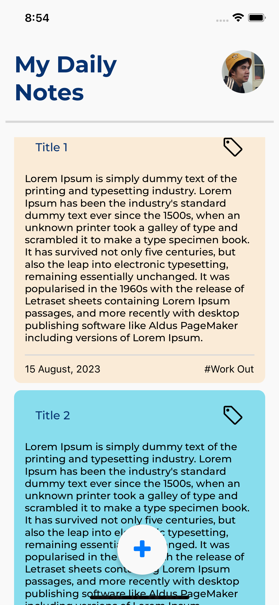
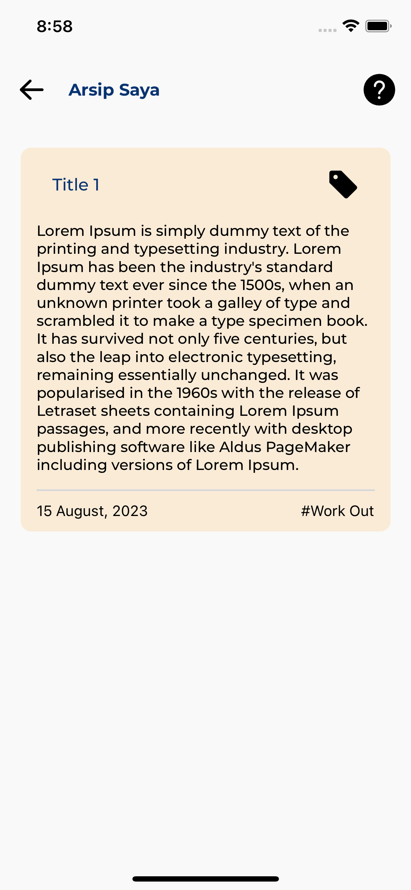
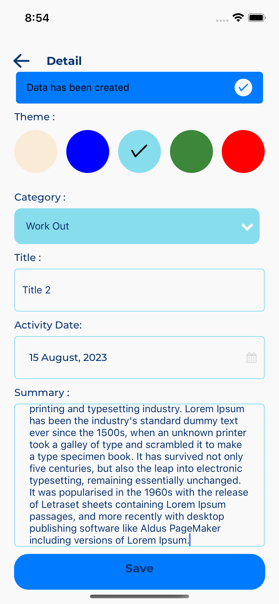
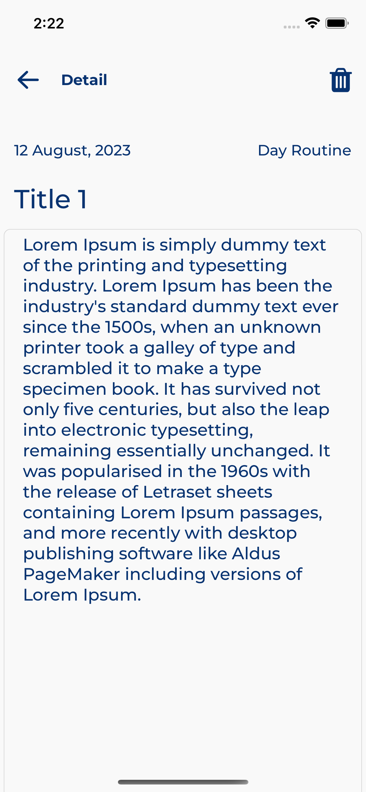

# react-native-noteapp

### About Application

sebuah aplikasi catatan harian sederhana yang dibangun menggunakan react native dan typescript yang dapat dijalankan di platform Android dan Ios

- Fitur : Create, Update, Edit, Delete, Arsip
- Bahasa Pemograman : Typecript
- Kerangka Kerja : React Native
- Bahasa Markup : HTML, CSS

  ### Screenshoot

    

    

